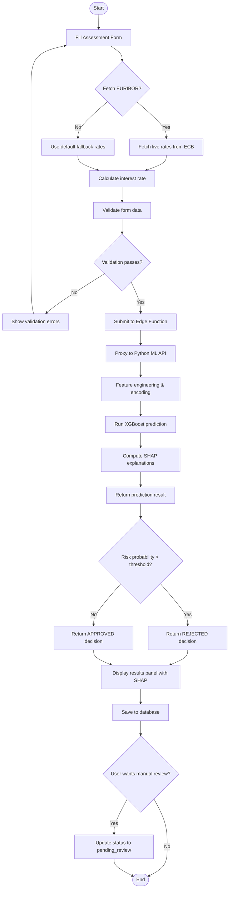

```mermaid
%% Activity Diagram: Loan Assessment Process
%% End-to-end flow from form submission to decision

graph TD
    A([Start]) --> B[Fill Assessment Form]
    B --> C{Fetch EURIBOR?}
    C -->|Yes| D[Fetch live rates from ECB]
    C -->|No| E[Use default fallback rates]
    D --> F[Calculate interest rate]
    E --> F
    F --> G[Validate form data]
    G --> H{Validation passes?}
    H -->|No| I[Show validation errors]
    I --> B
    H -->|Yes| J[Submit to Edge Function]
    J --> K[Proxy to Python ML API]
    K --> L[Feature engineering & encoding]
    L --> M[Run XGBoost prediction]
    M --> N[Compute SHAP explanations]
    N --> O[Return prediction result]
    O --> P{Risk probability > threshold?}
    P -->|Yes| Q[Return REJECTED decision]
    P -->|No| R[Return APPROVED decision]
    Q --> S[Display results panel with SHAP]
    R --> S
    S --> T[Save to database]
    T --> U{User wants manual review?}
    U -->|Yes| V[Update status to pending_review]
    U -->|No| W([End])
    V --> W
```
