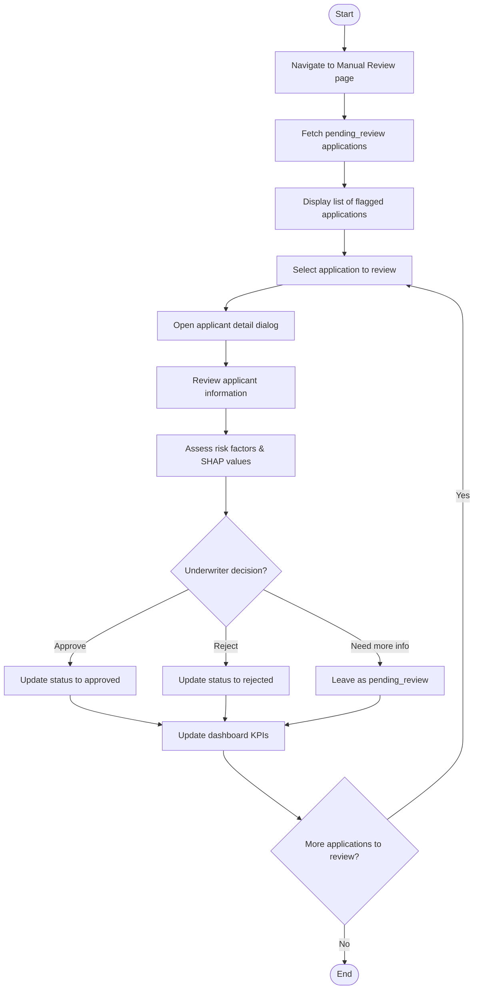

```mermaid
%% Activity Diagram: Manual Underwriting Review Process
%% Flow for underwriters reviewing flagged applications

graph TD
    A([Start]) --> B[Navigate to Manual Review page]
    B --> C[Fetch pending_review applications]
    C --> D[Display list of flagged applications]
    D --> E[Select application to review]
    E --> F[Open applicant detail dialog]
    F --> G[Review applicant information]
    G --> H[Assess risk factors & SHAP values]
    H --> I{Underwriter decision?}
    I -->|Approve| J[Update status to approved]
    I -->|Reject| K[Update status to rejected]
    I -->|Need more info| L[Leave as pending_review]
    J --> M[Update dashboard KPIs]
    K --> M
    L --> M
    M --> N{More applications to review?}
    N -->|Yes| E
    N -->|No| O([End])
```
