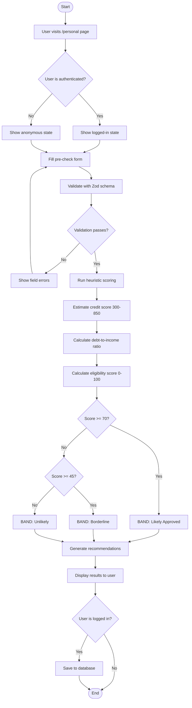

```mermaid
%% Activity Diagram: Personal Loan Pre-Check Flow
%% Public self-service eligibility estimation process

graph TD
    A([Start]) --> B[User visits /personal page]
    B --> C{User is authenticated?}
    C -->|Yes| D[Show logged-in state]
    C -->|No| E[Show anonymous state]
    D --> F[Fill pre-check form]
    E --> F
    F --> G[Validate with Zod schema]
    G --> H{Validation passes?}
    H -->|No| I[Show field errors]
    I --> F
    H -->|Yes| J[Run heuristic scoring]
    J --> K[Estimate credit score 300-850]
    K --> L[Calculate debt-to-income ratio]
    L --> M[Calculate eligibility score 0-100]
    M --> N{Score >= 70?}
    N -->|Yes| O[BAND: Likely Approved]
    N -->|No| P{Score >= 45?}
    P -->|Yes| Q[BAND: Borderline]
    P -->|No| R[BAND: Unlikely]
    O --> S[Generate recommendations]
    Q --> S
    R --> S
    S --> T[Display results to user]
    T --> U{User is logged in?}
    U -->|Yes| V[Save to database]
    U -->|No| W([End])
    V --> W
```
