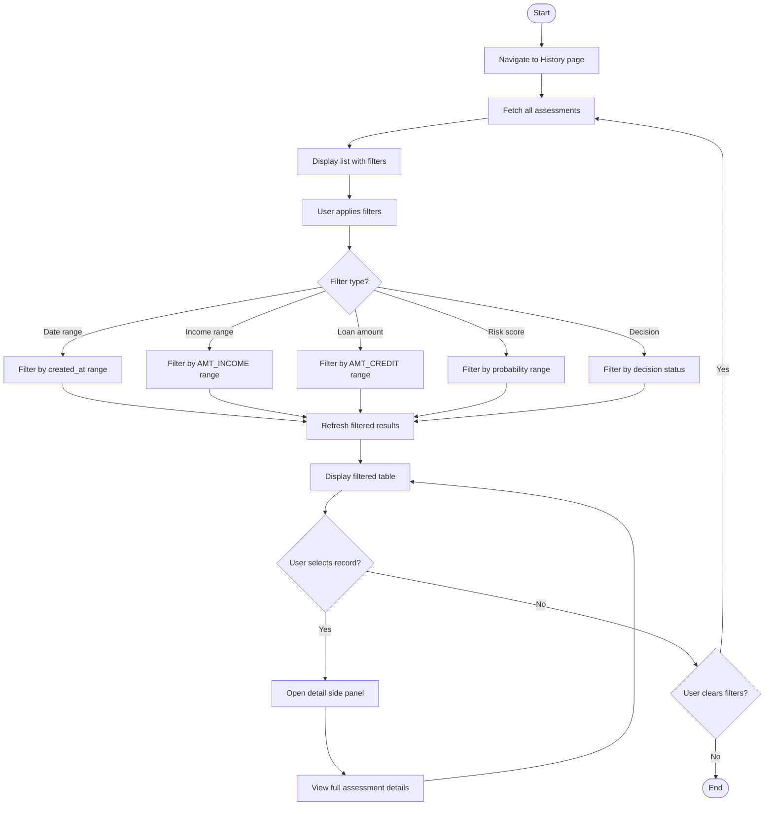

```mermaid
%% Activity Diagram: Assessment History Search Flow
%% How users search and filter through past assessments

graph TD
    A([Start]) --> B[Navigate to History page]
    B --> C[Fetch all assessments]
    C --> D[Display list with filters]
    D --> E[User applies filters]
    E --> F{Filter type?}
    F -->|Date range| G[Filter by created_at range]
    F -->|Income range| H[Filter by AMT_INCOME range]
    F -->|Loan amount| I[Filter by AMT_CREDIT range]
    F -->|Risk score| J[Filter by probability range]
    F -->|Decision| K[Filter by decision status]
    G --> L[Refresh filtered results]
    H --> L
    I --> L
    J --> L
    K --> L
    L --> M[Display filtered table]
    M --> N{User selects record?}
    N -->|Yes| O[Open detail side panel]
    O --> P[View full assessment details]
    P --> M
    N -->|No| Q{User clears filters?}
    Q -->|Yes| C
    Q -->|No| R([End])
```
