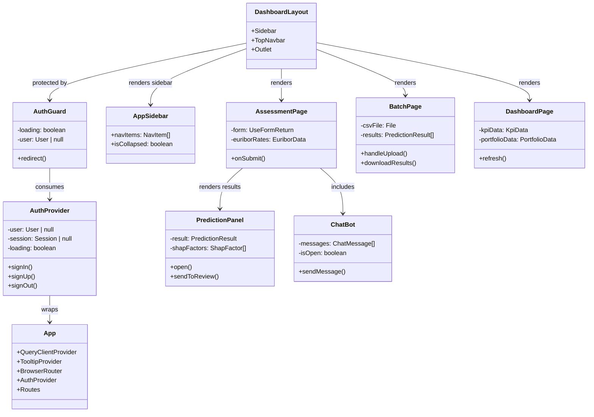

```mermaid
%% Class Diagram: React Component Tree & State Management
%% Shows the frontend architecture with main components, contexts, and data flow

classDiagram
    class App {
        +QueryClientProvider
        +TooltipProvider
        +BrowserRouter
        +AuthProvider
        +Routes
    }

    class AuthProvider {
        -user: User | null
        -session: Session | null
        -loading: boolean
        +signIn()
        +signUp()
        +signOut()
    }

    class AuthGuard {
        -loading: boolean
        -user: User | null
        +redirect()
    }

    class DashboardLayout {
        +Sidebar
        +TopNavbar
        +Outlet
    }

    class AppSidebar {
        +navItems: NavItem[]
        +isCollapsed: boolean
    }

    class AssessmentPage {
        -form: UseFormReturn
        -euriborRates: EuriborData
        +onSubmit()
    }

    class BatchPage {
        -csvFile: File
        -results: PredictionResult[]
        +handleUpload()
        +downloadResults()
    }

    class DashboardPage {
        -kpiData: KpiData
        -portfolioData: PortfolioData
        +refresh()
    }

    class PredictionPanel {
        -result: PredictionResult
        -shapFactors: ShapFactor[]
        +open()
        +sendToReview()
    }

    class ChatBot {
        -messages: ChatMessage[]
        -isOpen: boolean
        +sendMessage()
    }

    AuthProvider --> App : wraps
    AuthGuard --> AuthProvider : consumes
    DashboardLayout --> AuthGuard : protected by
    AssessmentPage --> PredictionPanel : renders results
    AssessmentPage --> ChatBot : includes
    DashboardLayout --> AppSidebar : renders sidebar
    DashboardLayout --> DashboardPage : renders
    DashboardLayout --> AssessmentPage : renders
    DashboardLayout --> BatchPage : renders
```
