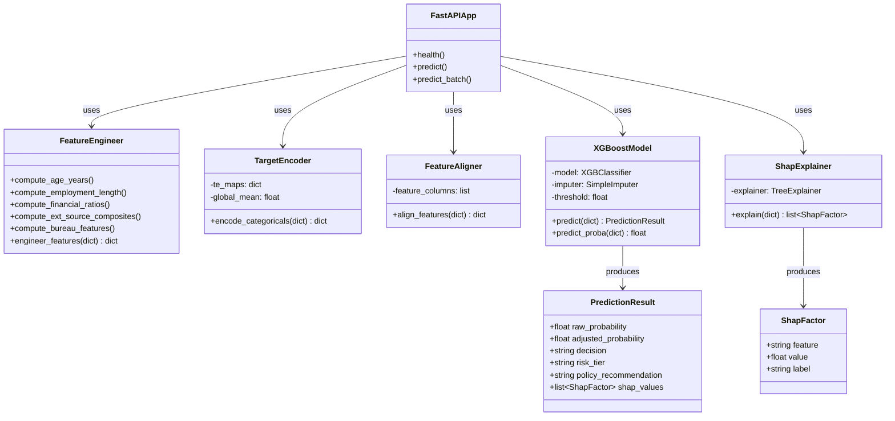

```mermaid
%% Class Diagram: ML Model Pipeline Architecture
%% Shows the Python ML service classes and data transformation flow

classDiagram
    class FastAPIApp {
        +health()
        +predict()
        +predict_batch()
    }

    class FeatureEngineer {
        +compute_age_years()
        +compute_employment_length()
        +compute_financial_ratios()
        +compute_ext_source_composites()
        +compute_bureau_features()
        +engineer_features(dict) dict
    }

    class TargetEncoder {
        -te_maps: dict
        -global_mean: float
        +encode_categoricals(dict) dict
    }

    class FeatureAligner {
        -feature_columns: list
        +align_features(dict) dict
    }

    class XGBoostModel {
        -model: XGBClassifier
        -imputer: SimpleImputer
        -threshold: float
        +predict(dict) PredictionResult
        +predict_proba(dict) float
    }

    class ShapExplainer {
        -explainer: TreeExplainer
        +explain(dict) list~ShapFactor~
    }

    class PredictionResult {
        +float raw_probability
        +float adjusted_probability
        +string decision
        +string risk_tier
        +string policy_recommendation
        +list~ShapFactor~ shap_values
    }

    class ShapFactor {
        +string feature
        +float value
        +string label
    }

    FastAPIApp --> FeatureEngineer : uses
    FastAPIApp --> TargetEncoder : uses
    FastAPIApp --> FeatureAligner : uses
    FastAPIApp --> XGBoostModel : uses
    FastAPIApp --> ShapExplainer : uses
    XGBoostModel --> PredictionResult : produces
    ShapExplainer --> ShapFactor : produces
```
