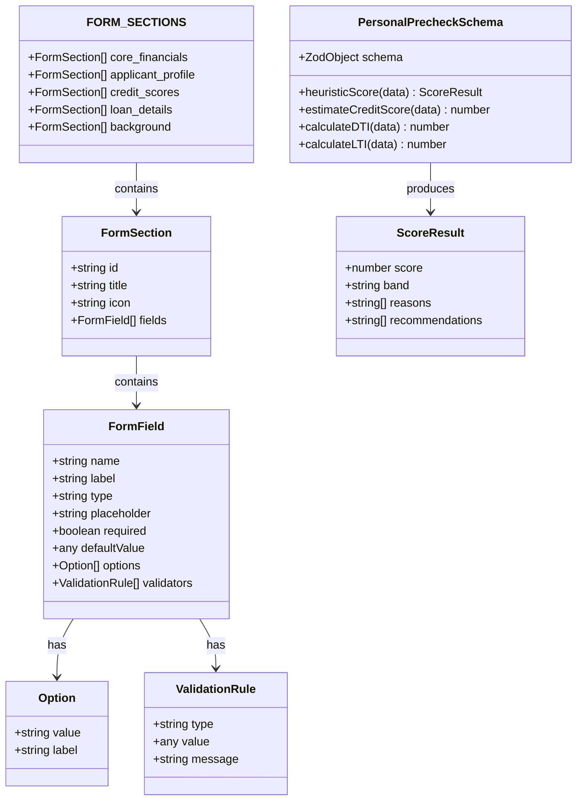

```mermaid
%% Class Diagram: Form Configuration System
%% Shows the config-driven form architecture for the assessment page

classDiagram
    class FormSection {
        +string id
        +string title
        +string icon
        +FormField[] fields
    }

    class FormField {
        +string name
        +string label
        +string type
        +string placeholder
        +boolean required
        +any defaultValue
        +Option[] options
        +ValidationRule[] validators
    }

    class Option {
        +string value
        +string label
    }

    class ValidationRule {
        +string type
        +any value
        +string message
    }

    class FORM_SECTIONS {
        +FormSection[] core_financials
        +FormSection[] applicant_profile
        +FormSection[] credit_scores
        +FormSection[] loan_details
        +FormSection[] background
    }

    class PersonalPrecheckSchema {
        +ZodObject schema
        +heuristicScore(data) ScoreResult
        +estimateCreditScore(data) number
        +calculateDTI(data) number
        +calculateLTI(data) number
    }

    class ScoreResult {
        +number score
        +string band
        +string[] reasons
        +string[] recommendations
    }

    FORM_SECTIONS --> FormSection : contains
    FormSection --> FormField : contains
    FormField --> Option : has
    FormField --> ValidationRule : has
    PersonalPrecheckSchema --> ScoreResult : produces
```
