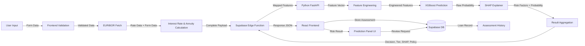

```mermaid
%% Data Flow Diagram: Credit Assessment Data Flow
%% Shows how data moves from user input through the system to storage

graph LR
    U[User Input] -->|Form Data| F[Frontend Validation]
    F -->|Validated Data| EU[EURIBOR Fetch]
    EU -->|Rate Data + Form Data| CALC[Interest Rate & Annuity Calculation]
    CALC -->|Complete Payload| EF[Supabase Edge Function]
    EF -->|Mapped Features| PY[Python FastAPI]
    PY -->|Feature Vector| FEAT[Feature Engineering]
    FEAT -->|Engineered Features| PRED[XGBoost Prediction]
    PRED -->|Raw Probability| SHAP[SHAP Explainer]
    SHAP -->|Risk Factors + Probability| RES[Result Aggregation]
    RES -->|Decision, Tier, SHAP, Policy| EF
    EF -->|Response JSON| FE[React Frontend]
    FE -->|Store Assessment| DB[(Supabase DB)]
    DB -->|Loan Record| HIST[Assessment History]
    FE -->|Risk Result| PANEL[Prediction Panel UI]
    PANEL -->|Review Request| DB
```
