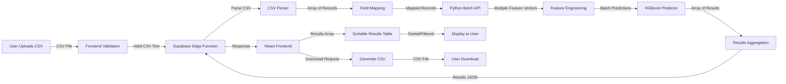

```mermaid
%% Data Flow Diagram: Batch CSV Processing Data Flow
%% Shows how CSV data flows through the batch processing pipeline

graph LR
    U[User Uploads CSV] -->|CSV File| VAL[Frontend Validation]
    VAL -->|Valid CSV Text| EF[Supabase Edge Function]
    EF -->|Parse CSV| PARSE[CSV Parser]
    PARSE -->|Array of Records| MAP[Field Mapping]
    MAP -->|Mapped Records| BATCH[Python Batch API]
    BATCH -->|Multiple Feature Vectors| FEAT[Feature Engineering]
    FEAT -->|Batch Predictions| PRED[XGBoost Predictor]
    PRED -->|Array of Results| AGG[Results Aggregation]
    AGG -->|Results JSON| EF
    EF -->|Response| FE[React Frontend]
    FE -->|Results Array| TABLE[Sortable Results Table]
    TABLE -->|Sorted/Filtered| DISP[Display to User]
    FE -->|Download Request| CSV[Generate CSV]
    CSV -->|CSV File| USER[User Download]
```
