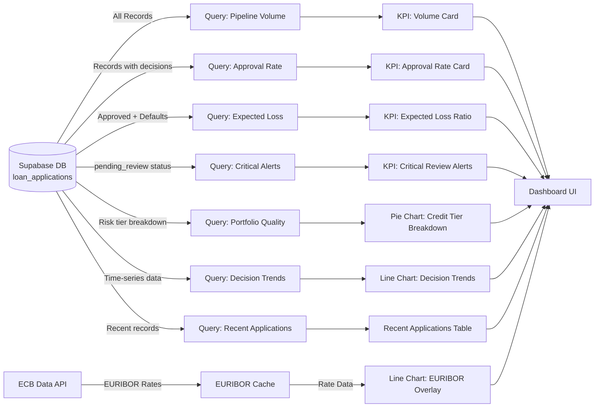

```mermaid
%% Data Flow Diagram: Portfolio Analytics Data Flow
%% Shows how data from the database is aggregated for the dashboard

graph LR
    DB[(Supabase DB<br/>loan_applications)] -->|All Records| Q1[Query: Pipeline Volume]
    DB -->|Records with decisions| Q2[Query: Approval Rate]
    DB -->|Approved + Defaults| Q3[Query: Expected Loss]
    DB -->|pending_review status| Q4[Query: Critical Alerts]
    DB -->|Risk tier breakdown| Q5[Query: Portfolio Quality]
    DB -->|Time-series data| Q6[Query: Decision Trends]
    DB -->|Recent records| Q7[Query: Recent Applications]
    
    Q1 --> KPI1[KPI: Volume Card]
    Q2 --> KPI2[KPI: Approval Rate Card]
    Q3 --> KPI3[KPI: Expected Loss Ratio]
    Q4 --> KPI4[KPI: Critical Review Alerts]
    Q5 --> CHART1[Pie Chart: Credit Tier Breakdown]
    Q6 --> CHART2[Line Chart: Decision Trends]
    Q7 --> TABLE[Recent Applications Table]
    
    ECB[ECB Data API] -->|EURIBOR Rates| EUROC[EURIBOR Cache]
    EUROC -->|Rate Data| CHART3[Line Chart: EURIBOR Overlay]
    
    KPI1 --> DASH[Dashboard UI]
    KPI2 --> DASH
    KPI3 --> DASH
    KPI4 --> DASH
    CHART1 --> DASH
    CHART2 --> DASH
    CHART3 --> DASH
    TABLE --> DASH
```
