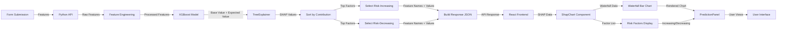

```mermaid
%% Data Flow Diagram: SHAP Explainability Data Flow
%% Shows how SHAP values are computed, transferred, and rendered

graph LR
    SUB[Form Submission] -->|Features| PY[Python API]
    PY -->|Raw Features| FE[Feature Engineering]
    FE -->|Processed Features| MODEL[XGBoost Model]
    MODEL -->|Base Value + Expected Value| EXPLAINER[TreeExplainer]
    EXPLAINER -->|SHAP Values| SORT[Sort by Contribution]
    SORT -->|Top Factors| POS[Select Risk-Increasing]
    SORT -->|Top Factors| NEG[Select Risk-Decreasing]
    POS -->|Feature Names + Values| JSON[Build Response JSON]
    NEG -->|Feature Names + Values| JSON
    JSON -->|API Response| FE2[React Frontend]
    FE2 -->|SHAP Data| SHAP_COMP[ShapChart Component]
    SHAP_COMP -->|Waterfall Data| WATERFALL[Waterfall Bar Chart]
    WATERFALL -->|Rendered Chart| PANEL[PredictionPanel]
    SHAP_COMP -->|Factor List| FACTORS[Risk Factors Display]
    FACTORS -->|Increasing/Decreasing| PANEL
    PANEL -->|User Views| UI[User Interface]
```
