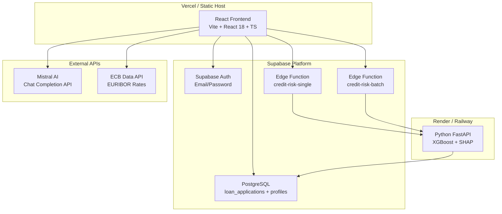

```mermaid
%% Deployment Diagram: Overall Infrastructure
%% Shows the deployment topology of all services

graph TB
    subgraph "Vercel / Static Host"
        FE[React Frontend<br/>Vite + React 18 + TS]
    end

    subgraph "Supabase Platform"
        direction TB
        SA[Supabase Auth<br/>Email/Password]
        DB[PostgreSQL<br/>loan_applications + profiles]
        EF1[Edge Function<br/>credit-risk-single]
        EF2[Edge Function<br/>credit-risk-batch]
    end

    subgraph "Render / Railway"
        PY[Python FastAPI<br/>XGBoost + SHAP]
    end

    subgraph "External APIs"
        MISTRAL[Mistral AI<br/>Chat Completion API]
        ECB[ECB Data API<br/>EURIBOR Rates]
    end

    FE --> SA
    FE --> DB
    FE --> EF1
    FE --> EF2
    FE --> MISTRAL
    FE --> ECB
    EF1 --> PY
    EF2 --> PY
    PY --> DB
```
