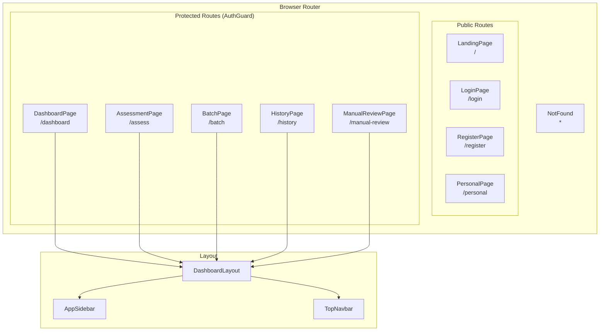

```mermaid
%% Deployment Diagram: Frontend Route Architecture
%% Shows the React Router structure and component mapping

graph TB
    subgraph "Browser Router"
        direction TB
        
        subgraph "Public Routes"
            LAND[LandingPage<br/>/]
            LOGIN[LoginPage<br/>/login]
            REG[RegisterPage<br/>/register]
            PERS[PersonalPage<br/>/personal]
        end
        
        subgraph "Protected Routes (AuthGuard)"
            DASH[DashboardPage<br/>/dashboard]
            ASSESS[AssessmentPage<br/>/assess]
            BATCH[BatchPage<br/>/batch]
            HIST[HistoryPage<br/>/history]
            REVIEW[ManualReviewPage<br/>/manual-review]
        end
        
        NF[NotFound<br/>*]
    end

    subgraph "Layout"
        DL[DashboardLayout]
        SB[AppSidebar]
        TN[TopNavbar]
    end

    DL --> SB
    DL --> TN
    DASH --> DL
    ASSESS --> DL
    BATCH --> DL
    HIST --> DL
    REVIEW --> DL
```
