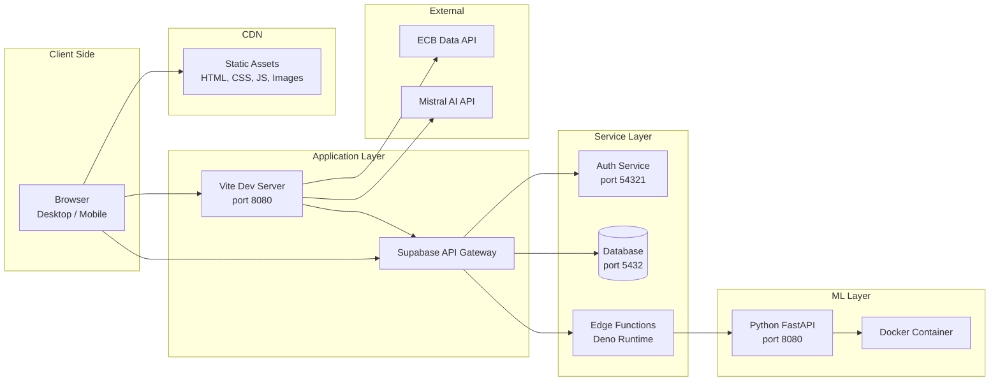

```mermaid
%% Deployment Diagram: Network Topology
%% Shows how clients connect to services across the infrastructure

graph LR
    subgraph "Client Side"
        BROWSER[Browser<br/>Desktop / Mobile]
    end

    subgraph "CDN"
        STATIC[Static Assets<br/>HTML, CSS, JS, Images]
    end

    subgraph "Application Layer"
        VITE[Vite Dev Server<br/>port 8080]
        API_GATE[Supabase API Gateway]
    end

    subgraph "Service Layer"
        AUTH[Auth Service<br/>port 54321]
        DB[(Database<br/>port 5432)]
        EDGE[Edge Functions<br/>Deno Runtime]
    end

    subgraph "ML Layer"
        FASTAPI[Python FastAPI<br/>port 8080]
        DOCKER[Docker Container]
    end

    subgraph "External"
        ECB_API[ECB Data API]
        MISTRAL[Mistral AI API]
    end

    BROWSER --> STATIC
    BROWSER --> VITE
    BROWSER --> API_GATE
    API_GATE --> AUTH
    API_GATE --> DB
    API_GATE --> EDGE
    EDGE --> FASTAPI
    FASTAPI --> DOCKER
    VITE --> ECB_API
    VITE --> MISTRAL
    VITE --> API_GATE
```
