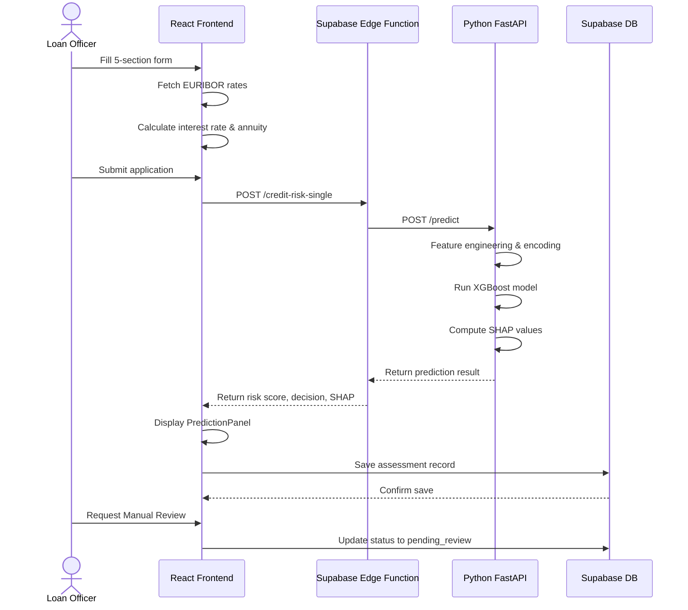

```mermaid
%% Sequence Diagram: Single Credit Assessment Flow
%% Shows the interaction between User, Frontend, Edge Function, Python API, and Database

sequenceDiagram
    actor U as Loan Officer
    participant FE as React Frontend
    participant EF as Supabase Edge Function
    participant PY as Python FastAPI
    participant DB as Supabase DB

    U->>FE: Fill 5-section form
    FE->>FE: Fetch EURIBOR rates
    FE->>FE: Calculate interest rate & annuity
    U->>FE: Submit application
    FE->>EF: POST /credit-risk-single
    EF->>PY: POST /predict
    PY->>PY: Feature engineering & encoding
    PY->>PY: Run XGBoost model
    PY->>PY: Compute SHAP values
    PY-->>EF: Return prediction result
    EF-->>FE: Return risk score, decision, SHAP
    FE->>FE: Display PredictionPanel
    FE->>DB: Save assessment record
    DB-->>FE: Confirm save
    U->>FE: Request Manual Review
    FE->>DB: Update status to pending_review
```
