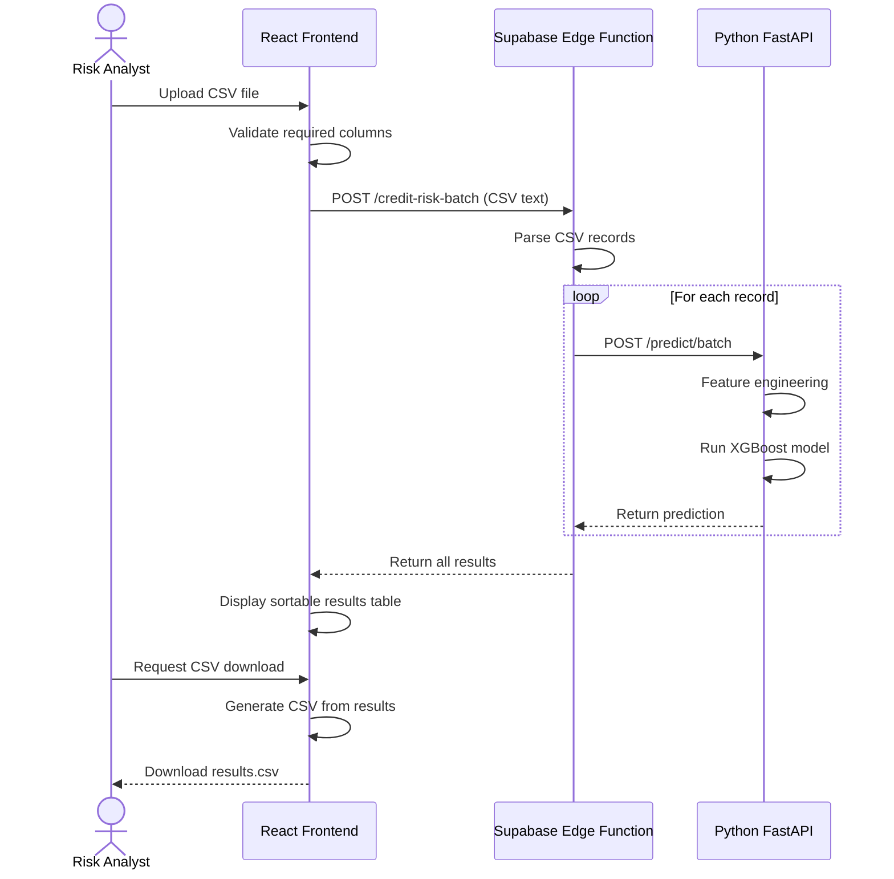

```mermaid
%% Sequence Diagram: Batch CSV Processing Flow
%% Shows the interaction between User, Frontend, Edge Function, Python API

sequenceDiagram
    actor U as Risk Analyst
    participant FE as React Frontend
    participant EF as Supabase Edge Function
    participant PY as Python FastAPI

    U->>FE: Upload CSV file
    FE->>FE: Validate required columns
    FE->>EF: POST /credit-risk-batch (CSV text)
    EF->>EF: Parse CSV records
    loop For each record
        EF->>PY: POST /predict/batch
        PY->>PY: Feature engineering
        PY->>PY: Run XGBoost model
        PY-->>EF: Return prediction
    end
    EF-->>FE: Return all results
    FE->>FE: Display sortable results table
    U->>FE: Request CSV download
    FE->>FE: Generate CSV from results
    FE-->>U: Download results.csv
```
