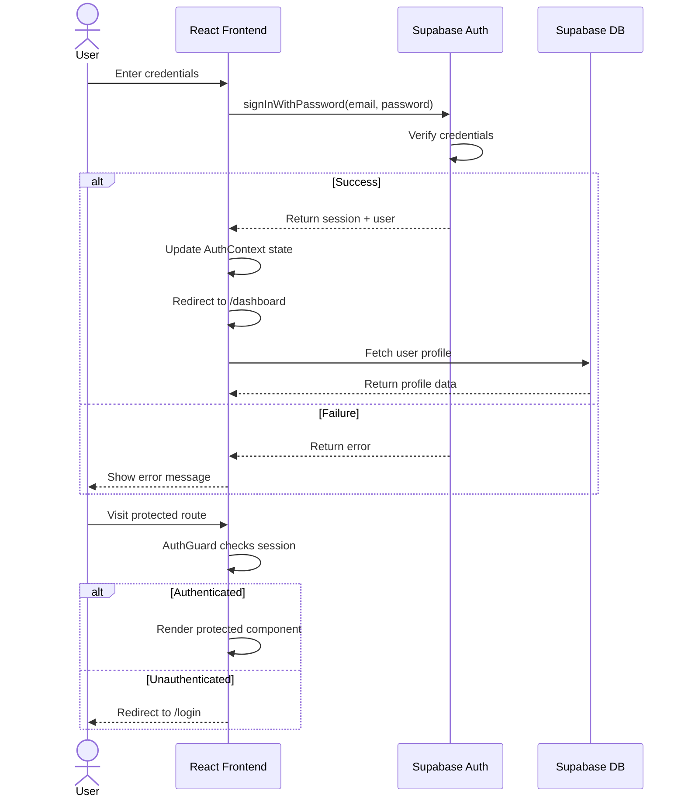

```mermaid
%% Sequence Diagram: User Authentication Flow
%% Shows the interaction between User, Frontend, and Supabase Auth

sequenceDiagram
    actor U as User
    participant FE as React Frontend
    participant SA as Supabase Auth
    participant DB as Supabase DB

    U->>FE: Enter credentials
    FE->>SA: signInWithPassword(email, password)
    SA->>SA: Verify credentials
    alt Success
        SA-->>FE: Return session + user
        FE->>FE: Update AuthContext state
        FE->>FE: Redirect to /dashboard
        FE->>DB: Fetch user profile
        DB-->>FE: Return profile data
    else Failure
        SA-->>FE: Return error
        FE-->>U: Show error message
    end
    U->>FE: Visit protected route
    FE->>FE: AuthGuard checks session
    alt Authenticated
        FE->>FE: Render protected component
    else Unauthenticated
        FE-->>U: Redirect to /login
    end
```
