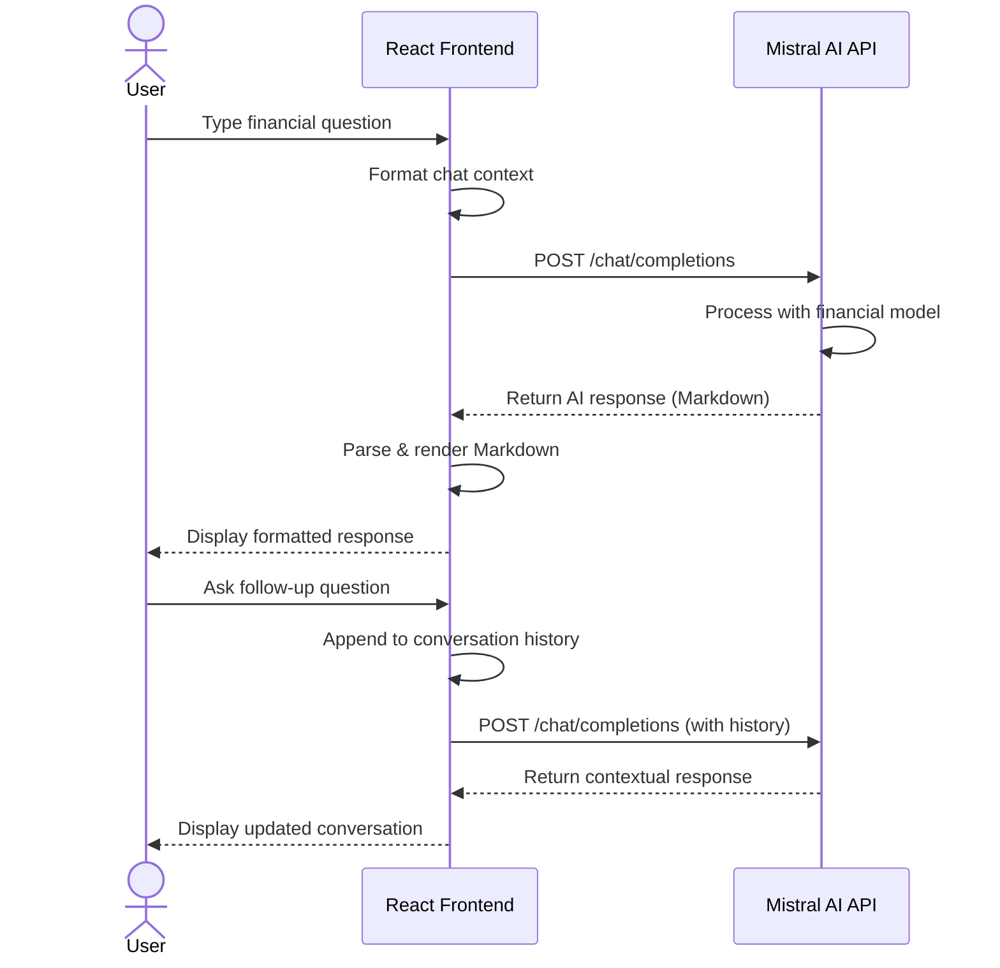

```mermaid
%% Sequence Diagram: AI Financial Assistant Chat
%% Shows the interaction between User, Frontend, and Mistral AI API

sequenceDiagram
    actor U as User
    participant FE as React Frontend
    participant MA as Mistral AI API

    U->>FE: Type financial question
    FE->>FE: Format chat context
    FE->>MA: POST /chat/completions
    MA->>MA: Process with financial model
    MA-->>FE: Return AI response (Markdown)
    FE->>FE: Parse & render Markdown
    FE-->>U: Display formatted response
    U->>FE: Ask follow-up question
    FE->>FE: Append to conversation history
    FE->>MA: POST /chat/completions (with history)
    MA-->>FE: Return contextual response
    FE-->>U: Display updated conversation
```
