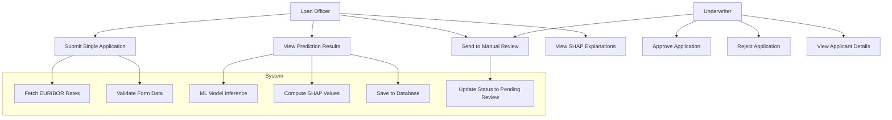

```mermaid
%% Use Case: Single Credit Assessment
%% Actors: Loan Officer, Underwriter, System (ML Engine, Supabase)

graph TB
    A[Loan Officer] --> UC1[Submit Single Application]
    A --> UC2[View Prediction Results]
    A --> UC3[Send to Manual Review]
    A --> UC4[View SHAP Explanations]

    B[Underwriter] --> UC3
    B --> UC5[Approve Application]
    B --> UC6[Reject Application]
    B --> UC7[View Applicant Details]

    UC1 --> S1[Fetch EURIBOR Rates]
    UC1 --> S2[Validate Form Data]
    UC2 --> S3[ML Model Inference]
    UC2 --> S4[Compute SHAP Values]
    UC2 --> S5[Save to Database]
    UC3 --> S6[Update Status to Pending Review]

    subgraph System
        S1
        S2
        S3
        S4
        S5
        S6
    end
```
