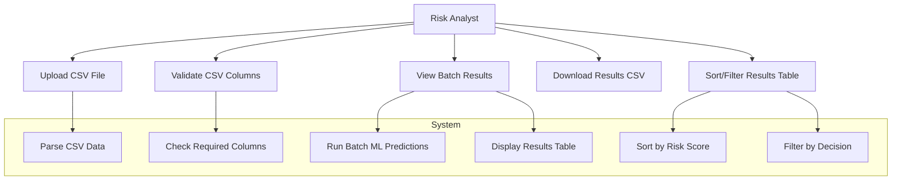

```mermaid
%% Use Case: Batch CSV Processing
%% Actors: Risk Analyst, System (CSV Parser, ML Engine)

graph TB
    A[Risk Analyst] --> UC1[Upload CSV File]
    A --> UC2[Validate CSV Columns]
    A --> UC3[View Batch Results]
    A --> UC4[Download Results CSV]
    A --> UC5[Sort/Filter Results Table]

    UC1 --> S1[Parse CSV Data]
    UC2 --> S2[Check Required Columns]
    UC3 --> S3[Run Batch ML Predictions]
    UC3 --> S4[Display Results Table]
    UC5 --> S5[Sort by Risk Score]
    UC5 --> S6[Filter by Decision]

    subgraph System
        S1
        S2
        S3
        S4
        S5
        S6
    end
```
