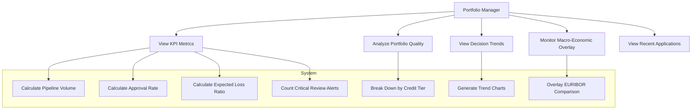

```mermaid
%% Use Case: Portfolio Dashboard
%% Actors: Portfolio Manager, System (Analytics Engine)

graph TB
    A[Portfolio Manager] --> UC1[View KPI Metrics]
    A --> UC2[Analyze Portfolio Quality]
    A --> UC3[View Decision Trends]
    A --> UC4[Monitor Macro-Economic Overlay]
    A --> UC5[View Recent Applications]

    UC1 --> S1[Calculate Pipeline Volume]
    UC1 --> S2[Calculate Approval Rate]
    UC1 --> S3[Calculate Expected Loss Ratio]
    UC1 --> S4[Count Critical Review Alerts]
    UC2 --> S5[Break Down by Credit Tier]
    UC3 --> S6[Generate Trend Charts]
    UC4 --> S7[Overlay EURIBOR Comparison]

    subgraph System
        S1
        S2
        S3
        S4
        S5
        S6
        S7
    end
```
