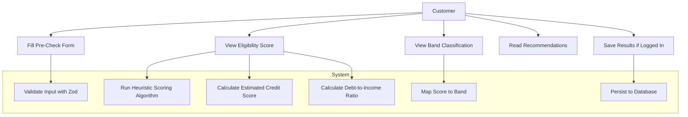

```mermaid
%% Use Case: Personal Loan Pre-Check (Public)
%% Actors: Customer (Unauthenticated), System (Heuristic Engine)

graph TB
    A[Customer] --> UC1[Fill Pre-Check Form]
    A --> UC2[View Eligibility Score]
    A --> UC3[View Band Classification]
    A --> UC4[Read Recommendations]
    A --> UC5[Save Results if Logged In]

    UC1 --> S1[Validate Input with Zod]
    UC2 --> S2[Run Heuristic Scoring Algorithm]
    UC2 --> S3[Calculate Estimated Credit Score]
    UC2 --> S4[Calculate Debt-to-Income Ratio]
    UC3 --> S5[Map Score to Band]
    UC5 --> S6[Persist to Database]

    subgraph System
        S1
        S2
        S3
        S4
        S5
        S6
    end
```
