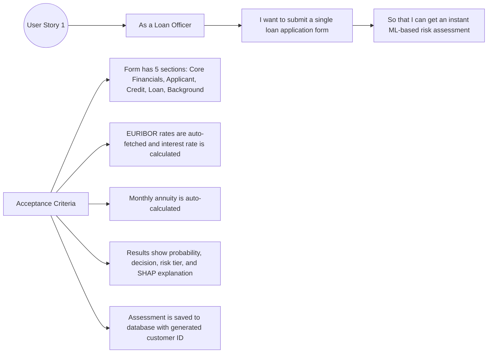

```mermaid
%% User Story Map: Single Credit Assessment
%% As a Loan Officer, I want to submit a loan application and get an instant ML-based risk assessment

graph LR
    A((User Story 1)) --> B[As a Loan Officer]
    B --> C[I want to submit a single loan application form]
    C --> D[So that I can get an instant ML-based risk assessment]
    
    E[Acceptance Criteria] --> F[Form has 5 sections: Core Financials, Applicant, Credit, Loan, Background]
    E --> G[EURIBOR rates are auto-fetched and interest rate is calculated]
    E --> H[Monthly annuity is auto-calculated]
    E --> I[Results show probability, decision, risk tier, and SHAP explanation]
    E --> J[Assessment is saved to database with generated customer ID]
```
