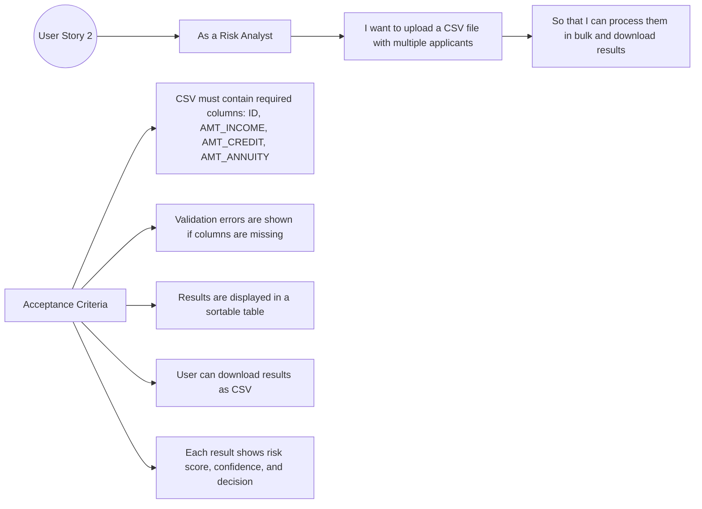

```mermaid
%% User Story Map: Batch CSV Processing
%% As a Risk Analyst, I want to upload a CSV of applicants and get bulk predictions

graph LR
    A((User Story 2)) --> B[As a Risk Analyst]
    B --> C[I want to upload a CSV file with multiple applicants]
    C --> D[So that I can process them in bulk and download results]
    
    E[Acceptance Criteria] --> F[CSV must contain required columns: ID, AMT_INCOME, AMT_CREDIT, AMT_ANNUITY]
    E --> G[Validation errors are shown if columns are missing]
    E --> H[Results are displayed in a sortable table]
    E --> I[User can download results as CSV]
    E --> J[Each result shows risk score, confidence, and decision]
```
