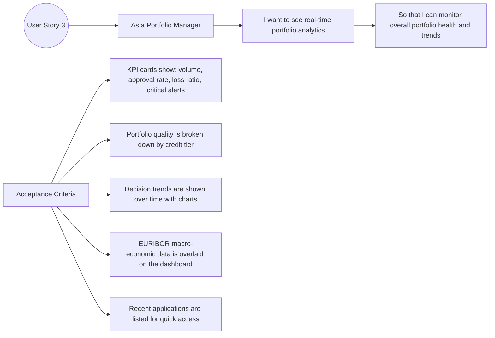

```mermaid
%% User Story Map: Portfolio Dashboard
%% As a Portfolio Manager, I want to monitor portfolio health in real-time

graph LR
    A((User Story 3)) --> B[As a Portfolio Manager]
    B --> C[I want to see real-time portfolio analytics]
    C --> D[So that I can monitor overall portfolio health and trends]
    
    E[Acceptance Criteria] --> F[KPI cards show: volume, approval rate, loss ratio, critical alerts]
    E --> G[Portfolio quality is broken down by credit tier]
    E --> H[Decision trends are shown over time with charts]
    E --> I[EURIBOR macro-economic data is overlaid on the dashboard]
    E --> J[Recent applications are listed for quick access]
```
