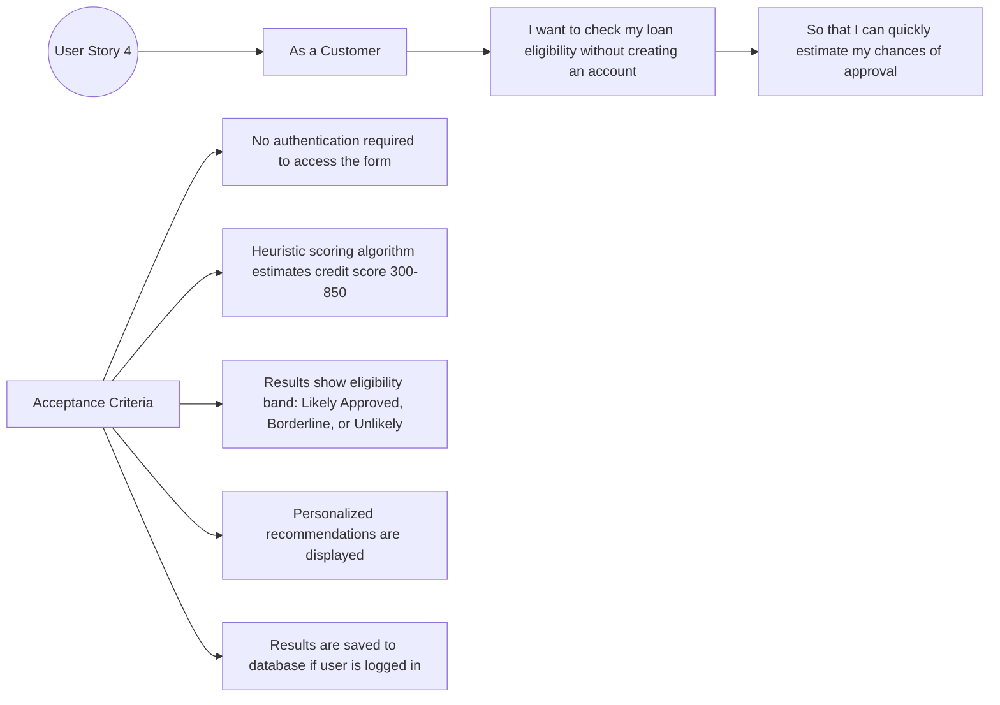

```mermaid
%% User Story Map: Personal Loan Pre-Check
%% As a Customer, I want to check my loan eligibility without logging in

graph LR
    A((User Story 4)) --> B[As a Customer]
    B --> C[I want to check my loan eligibility without creating an account]
    C --> D[So that I can quickly estimate my chances of approval]
    
    E[Acceptance Criteria] --> F[No authentication required to access the form]
    E --> G[Heuristic scoring algorithm estimates credit score 300-850]
    E --> H[Results show eligibility band: Likely Approved, Borderline, or Unlikely]
    E --> I[Personalized recommendations are displayed]
    E --> J[Results are saved to database if user is logged in]
```
