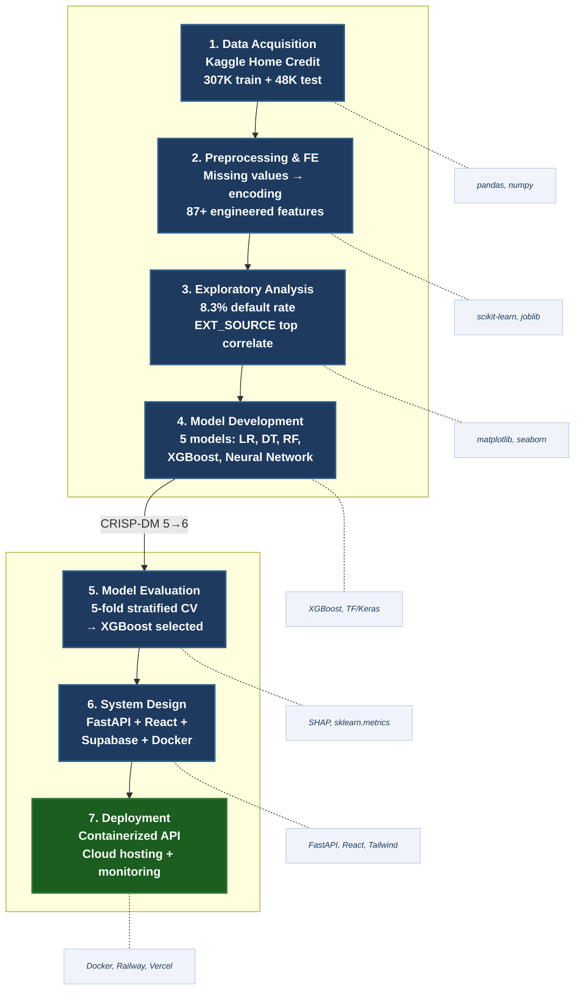

```mermaid
%% Figure 3.1 — High-Level Development Lifecycle Diagram
%% 7 phases flowing from data acquisition to deployment (2-row layout for print fit)

graph TB
    classDef phase fill:#1E3A5F,color:#fff,stroke:#2D5F8A,stroke-width:2px,font-weight:700
    classDef tech fill:#F0F4FA,color:#1E3A5F,stroke:#C0D0E0,stroke-width:1px,font-size:11px
    classDef final fill:#1B5E20,color:#fff,stroke:#2E7D32,stroke-width:2px,font-weight:700

    subgraph ROW1[" "]
        direction LR
        P1["1. Data Acquisition<br/>Kaggle Home Credit<br/>307K train + 48K test"]:::phase
        P2["2. Preprocessing & FE<br/>Missing values → encoding<br/>87+ engineered features"]:::phase
        P3["3. Exploratory Analysis<br/>8.3% default rate<br/>EXT_SOURCE top correlate"]:::phase
        P4["4. Model Development<br/>5 models: LR, DT, RF,<br/>XGBoost, Neural Network"]:::phase
    end

    subgraph ROW2[" "]
        direction LR
        P5["5. Model Evaluation<br/>5-fold stratified CV<br/>→ XGBoost selected"]:::phase
        P6["6. System Design<br/>FastAPI + React +<br/>Supabase + Docker"]:::phase
        P7["7. Deployment<br/>Containerized API<br/>Cloud hosting + monitoring"]:::final
    end

    T1[<i>pandas, numpy</i>]:::tech
    T2[<i>scikit-learn, joblib</i>]:::tech
    T3[<i>matplotlib, seaborn</i>]:::tech
    T4[<i>XGBoost, TF/Keras</i>]:::tech
    T5[<i>SHAP, sklearn.metrics</i>]:::tech
    T6[<i>FastAPI, React, Tailwind</i>]:::tech
    T7[<i>Docker, Railway, Vercel</i>]:::tech

    P1 --> P2
    P2 --> P3
    P3 --> P4
    P4 -->|"CRISP-DM 5→6"| P5
    P5 --> P6
    P6 --> P7

    P1 -.- T1
    P2 -.- T2
    P3 -.- T3
    P4 -.- T4
    P5 -.- T5
    P6 -.- T6
    P7 -.- T7
```
