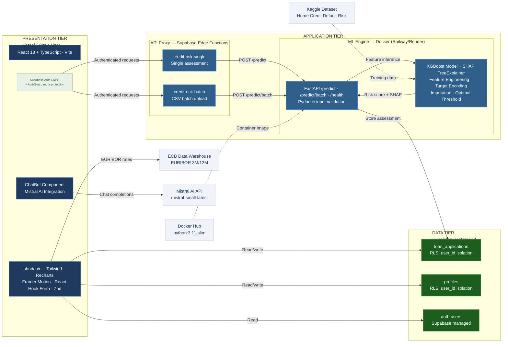

```mermaid
%% Figure 3.2 — Three-Tier System Architecture Diagram
%% Logical architecture: Presentation → Application → Data tiers with data flow and external integrations

graph LR
    classDef pres fill:#1E3A5F,color:#fff,stroke:#2D5F8A,stroke-width:2px
    classDef app fill:#2D5F8A,color:#fff,stroke:#4A7FB5,stroke-width:2px
    classDef data fill:#1B5E20,color:#fff,stroke:#2E7D32,stroke-width:2px
    classDef ext fill:#F0F4FA,color:#1E3A5F,stroke:#C0D0E0,stroke-width:1px
    classDef sec fill:#E8F0E8,color:#2D6A2D,stroke:#A0C0A0,stroke-width:1px,font-size:11px

    subgraph PRES["PRESENTATION TIER<br/><i>Vercel / Static Host</i>"]
        direction TB
        REACT["React 18 + TypeScript · Vite"]:::pres
        UI["shadcn/ui · Tailwind · Recharts<br/>Framer Motion · React Hook Form · Zod"]:::pres
        CHAT["ChatBot Component<br/>Mistral AI Integration"]:::pres
        AUTH["Supabase Auth (JWT)<br/>+ AuthGuard route protection"]:::sec
    end

    subgraph APP["APPLICATION TIER"]
        direction TB
        subgraph PROXY["API Proxy — Supabase Edge Functions"]
            EF1["credit-risk-single<br/>Single assessment"]:::app
            EF2["credit-risk-batch<br/>CSV batch upload"]:::app
        end
        subgraph ENGINE["ML Engine — Docker (Railway/Render)"]
            FASTAPI["FastAPI /predict · /predict/batch · /health<br/>Pydantic input validation"]:::app
            ML["XGBoost Model + SHAP TreeExplainer<br/>Feature Engineering · Target Encoding<br/>Imputation · Optimal Threshold"]:::app
        end
    end

    subgraph DATA["DATA TIER<br/><i>Supabase PostgreSQL</i>"]
        direction TB
        DB1["loan_applications<br/>RLS: user_id isolation"]:::data
        DB2["profiles<br/>RLS: user_id isolation"]:::data
        DB3["auth.users<br/>Supabase managed"]:::data
    end

    EXT_ECB["ECB Data Warehouse<br/>EURIBOR 3M/12M"]:::ext
    EXT_MISTRAL["Mistral AI API<br/>mistral-small-latest"]:::ext
    EXT_DOCKER["Docker Hub<br/>python:3.11-slim"]:::ext
    EXT_KAGGLE["Kaggle Dataset<br/>Home Credit Default Risk"]:::ext

    AUTH -->|Authenticated requests| EF1
    AUTH -->|Authenticated requests| EF2
    UI -->|EURIBOR rates| EXT_ECB
    CHAT -->|Chat completions| EXT_MISTRAL

    EF1 -->|POST /predict| FASTAPI
    EF2 -->|POST /predict/batch| FASTAPI
    FASTAPI -->|Feature inference| ML
    ML -->|Risk score + SHAP| FASTAPI
    FASTAPI -->|Store assessment| DB1

    UI -->|Read/write| DB1
    UI -->|Read/write| DB2
    UI -->|Read| DB3

    EXT_DOCKER -.->|Container image| FASTAPI
    EXT_KAGGLE -.->|Training data| ML
```
