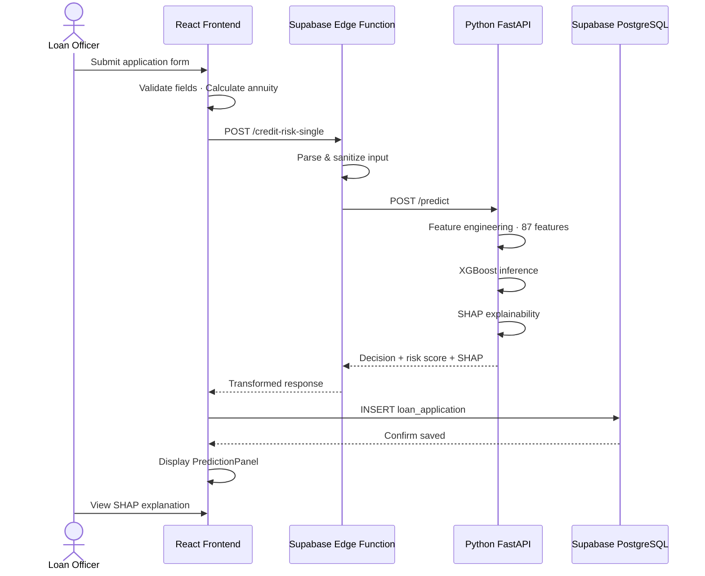

```mermaid
%% Figure 3.3 — Sequence Diagram: Single Assessment Request Flow
%% Clean high-level trace: React → Edge Function → FastAPI → SHAP → Supabase → React

sequenceDiagram
    actor U as Loan Officer
    participant FE as React Frontend
    participant EF as Supabase Edge Function
    participant API as Python FastAPI
    participant DB as Supabase PostgreSQL

    U->>FE: Submit application form
    FE->>FE: Validate fields · Calculate annuity
    FE->>EF: POST /credit-risk-single
    EF->>EF: Parse & sanitize input
    EF->>API: POST /predict
    API->>API: Feature engineering · 87 features
    API->>API: XGBoost inference
    API->>API: SHAP explainability
    API-->>EF: Decision + risk score + SHAP
    EF-->>FE: Transformed response
    FE->>DB: INSERT loan_application
    DB-->>FE: Confirm saved
    FE->>FE: Display PredictionPanel
    U->>FE: View SHAP explanation
```
