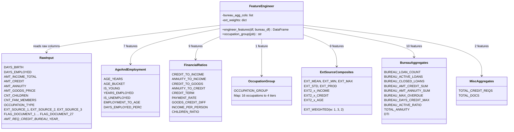

```mermaid
%% Figure 3.4 — Feature Engineering Pipeline Diagram
%% Class diagram of the FeatureEngineer transformer with input/output feature groups
%% Each output group shows the engineered feature names and their count

classDiagram
    class FeatureEngineer {
        +engineer_features(df, bureau_df) DataFrame
        +occupation_group(job) str
        -bureau_agg_cols: list
        -ext_weights: dict
    }

    class RawInput {
        DAYS_BIRTH
        DAYS_EMPLOYED
        AMT_INCOME_TOTAL
        AMT_CREDIT
        AMT_ANNUITY
        AMT_GOODS_PRICE
        CNT_CHILDREN
        CNT_FAM_MEMBERS
        OCCUPATION_TYPE
        EXT_SOURCE_1, EXT_SOURCE_2, EXT_SOURCE_3
        FLAG_DOCUMENT_1 ... FLAG_DOCUMENT_27
        AMT_REQ_CREDIT_BUREAU_YEAR_*
    }

    class AgeAndEmployment {
        AGE_YEARS
        AGE_BUCKET
        IS_YOUNG
        YEARS_EMPLOYED
        IS_UNEMPLOYED
        EMPLOYMENT_TO_AGE
        DAYS_EMPLOYED_PERC
    }

    class FinancialRatios {
        CREDIT_TO_INCOME
        ANNUITY_TO_INCOME
        CREDIT_TO_GOODS
        ANNUITY_TO_CREDIT
        CREDIT_TERM
        PAYMENT_RATE
        GOODS_CREDIT_DIFF
        INCOME_PER_PERSON
        CHILDREN_RATIO
    }

    class ExtSourceComposites {
        EXT_MEAN, EXT_MIN, EXT_MAX
        EXT_STD, EXT_PROD
        EXT_WEIGHTED (w: 1, 3, 2)
        EXT2_x_INCOME
        EXT2_x_CREDIT
        EXT2_x_AGE
    }

    class OccupationGroup {
        OCCUPATION_GROUP
        Map: 16 occupations to 4 tiers
    }

    class BureauAggregates {
        BUREAU_LOAN_COUNT
        BUREAU_ACTIVE_LOANS
        BUREAU_CLOSED_LOANS
        BUREAU_AMT_CREDIT_SUM
        BUREAU_AMT_ANNUITY_SUM
        BUREAU_MAX_OVERDUE
        BUREAU_DAYS_CREDIT_MAX
        BUREAU_ACTIVE_RATIO
        TOTAL_ANNUITY
        DTI
    }

    class MiscAggregates {
        TOTAL_CREDIT_REQS
        TOTAL_DOCS
    }

    FeatureEngineer --> RawInput : reads raw columns
    FeatureEngineer --> AgeAndEmployment : 7 features
    FeatureEngineer --> FinancialRatios : 9 features
    FeatureEngineer --> OccupationGroup : 1 feature
    FeatureEngineer --> ExtSourceComposites : 9 features
    FeatureEngineer --> BureauAggregates : 10 features
    FeatureEngineer --> MiscAggregates : 2 features
```
