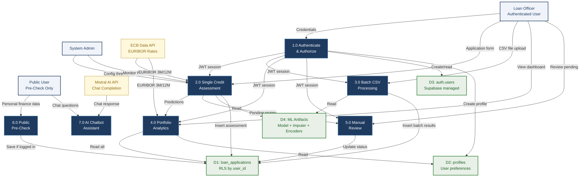

```mermaid
%% Figure 3.4 — System Data Flow Diagram (DFD Level 1)
%% Shows major sub-processes, external entities, data stores, and labeled data flows

graph TB
    classDef entity fill:#F0F4FA,color:#1E3A5F,stroke:#1E3A5F,stroke-width:2px
    classDef process fill:#1E3A5F,color:#fff,stroke:#2D5F8A,stroke-width:2px
    classDef store fill:#E8F0E8,color:#1B5E20,stroke:#2E7D32,stroke-width:2px
    classDef external fill:#FFF8DC,color:#8B6914,stroke:#D4C080,stroke-width:2px

    %% External Entities
    E1["Loan Officer<br/>Authenticated User"]:::entity
    E2["Public User<br/>Pre-Check Only"]:::entity
    E3["System Admin"]:::entity

    %% External Systems
    EXT1["ECB Data API<br/>EURIBOR Rates"]:::external
    EXT2["Mistral AI API<br/>Chat Completion"]:::external

    %% Processes
    P1["1.0 Authenticate<br/>& Authorize"]:::process
    P2["2.0 Single Credit<br/>Assessment"]:::process
    P3["3.0 Batch CSV<br/>Processing"]:::process
    P4["4.0 Portfolio<br/>Analytics"]:::process
    P5["5.0 Manual<br/>Review"]:::process
    P6["6.0 Public<br/>Pre-Check"]:::process
    P7["7.0 AI Chatbot<br/>Assistant"]:::process

    %% Data Stores
    D1["D1: loan_applications<br/>RLS by user_id"]:::store
    D2["D2: profiles<br/>User preferences"]:::store
    D3["D3: auth.users<br/>Supabase managed"]:::store
    D4["D4: ML Artifacts<br/>Model + Imputer + Encoders"]:::store

    %% Data Flows — External Entities to Processes
    E1 -->|Credentials| P1
    E1 -->|Application form| P2
    E1 -->|CSV file upload| P3
    E1 -->|View dashboard| P4
    E1 -->|Review pending| P5
    E2 -->|Personal finance data| P6
    E2 -->|Chat questions| P7
    E3 -->|Config thresholds| P2
    E3 -->|Monitor health| P2

    %% Data Flows — External Systems to Processes
    EXT1 -->|EURIBOR 3M/12M| P2
    EXT1 -->|EURIBOR 3M/12M| P4
    EXT2 -->|Chat response| P7

    %% Data Flows — Between Processes
    P1 -->|JWT session| P2
    P1 -->|JWT session| P3
    P1 -->|JWT session| P4
    P1 -->|JWT session| P5
    P2 -->|Predictions| P4
    P2 -->|Pending review| P5

    %% Data Flows — Processes to Data Stores
    P1 -->|Create/read| D3
    P1 -->|Create profile| D2
    P2 -->|Read| D4
    P2 -->|Insert assessment| D1
    P3 -->|Read| D4
    P3 -->|Insert batch results| D1
    P4 -->|Read all| D1
    P4 -->|Read| D2
    P5 -->|Update status| D1
    P6 -->|Save if logged in| D1
```
