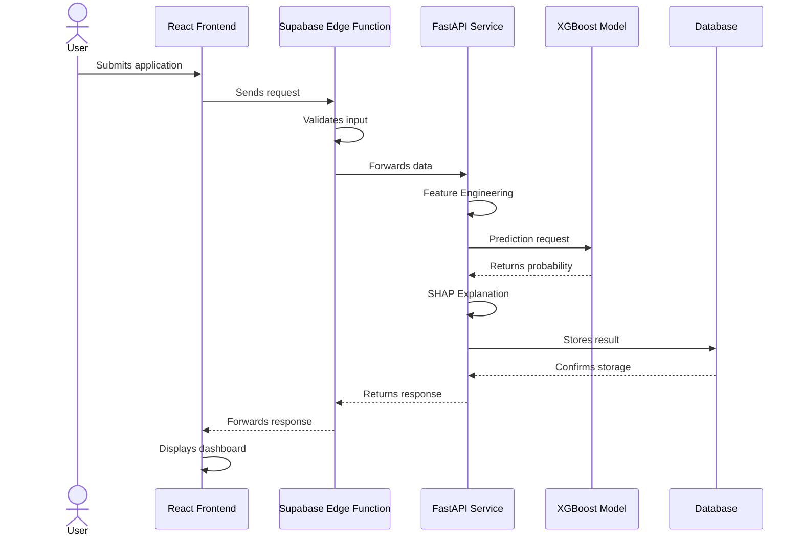

```mermaid
%% Figure 3.5 — Single Assessment Sequence Diagram
%% UML Sequence Diagram tracing the full request path from user submission to dashboard display

sequenceDiagram
    actor U as User
    participant FE as React Frontend
    participant EF as Supabase Edge Function
    participant API as FastAPI Service
    participant ML as XGBoost Model
    participant DB as Database

    U->>FE: Submits application
    FE->>EF: Sends request
    EF->>EF: Validates input
    EF->>API: Forwards data
    API->>API: Feature Engineering
    API->>ML: Prediction request
    ML-->>API: Returns probability
    API->>API: SHAP Explanation
    API->>DB: Stores result
    DB-->>API: Confirms storage
    API-->>EF: Returns response
    EF-->>FE: Forwards response
    FE->>FE: Displays dashboard
```
