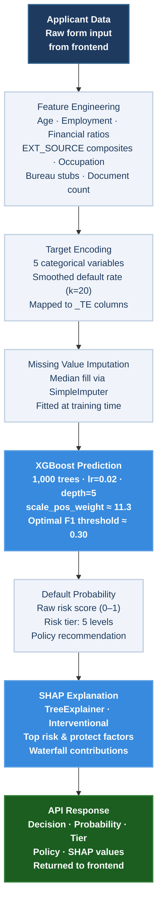

```mermaid
%% Figure 3.6 — Prediction Pipeline Architecture
%% Inference-time pipeline: raw applicant data → feature transformation → XGBoost → SHAP → API response

graph TB
    classDef input fill:#1E3A5F,color:#fff,stroke:#2D5F8A,stroke-width:2px,font-weight:700
    classDef step fill:#F0F4FA,color:#1E3A5F,stroke:#C0D0E0,stroke-width:2px
    classDef model fill:#378ADD,color:#fff,stroke:#5A9DE0,stroke-width:2px,font-weight:700
    classDef output fill:#1B5E20,color:#fff,stroke:#2E7D32,stroke-width:2px,font-weight:700

    S1["Applicant Data<br/>Raw form input<br/>from frontend"]:::input
    S2["Feature Engineering<br/>Age · Employment · Financial ratios<br/>EXT_SOURCE composites · Occupation<br/>Bureau stubs · Document count"]:::step
    S3["Target Encoding<br/>5 categorical variables<br/>Smoothed default rate (k=20)<br/>Mapped to _TE columns"]:::step
    S4["Missing Value Imputation<br/>Median fill via SimpleImputer<br/>Fitted at training time"]:::step
    S5["XGBoost Prediction<br/>1,000 trees · lr=0.02 · depth=5<br/>scale_pos_weight ≈ 11.3<br/>Optimal F1 threshold ≈ 0.30"]:::model
    S6["Default Probability<br/>Raw risk score (0–1)<br/>Risk tier: 5 levels<br/>Policy recommendation"]:::step
    S7["SHAP Explanation<br/>TreeExplainer · Interventional<br/>Top risk & protect factors<br/>Waterfall contributions"]:::model
    S8["API Response<br/>Decision · Probability · Tier<br/>Policy · SHAP values<br/>Returned to frontend"]:::output

    S1 --> S2
    S2 --> S3
    S3 --> S4
    S4 --> S5
    S5 --> S6
    S6 --> S7
    S7 --> S8
```
