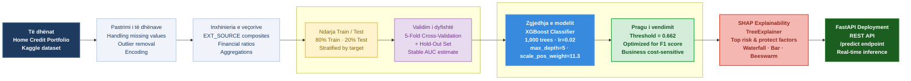

```mermaid
%% Figura — Diagrami i Pipeline-it të ML
%% Nga të dhënat → Cleaning → Feature Engineering → Train/Test → CV + Hold-out → XGBoost → Threshold → SHAP → FastAPI

graph LR
    classDef data fill:#1E3A5F,color:#fff,stroke:#2D5F8A,stroke-width:2px,font-weight:700
    classDef process fill:#F0F4FA,color:#1E3A5F,stroke:#C0D0E0,stroke-width:2px
    classDef split fill:#FFF3CD,color:#856404,stroke:#FFC107,stroke-width:2px
    classDef validate fill:#E8DAEF,color:#6C3483,stroke:#BB8FCE,stroke-width:2px
    classDef model fill:#378ADD,color:#fff,stroke:#5A9DE0,stroke-width:2px,font-weight:700
    classDef threshold fill:#D4EDDA,color:#155724,stroke:#28A745,stroke-width:2px,font-weight:700
    classDef shap fill:#F5B7B1,color:#922B21,stroke:#E74C3C,stroke-width:2px,font-weight:700
    classDef deploy fill:#1B5E20,color:#fff,stroke:#2E7D32,stroke-width:2px,font-weight:700

    A["Të dhënat<br/>Home Credit Portfolio<br/>Kaggle dataset"]:::data
    B["Pastrimi i të dhënave<br/>Handling missing values<br/>Outlier removal<br/>Encoding"]:::process
    C["Inxhinieria e veçorive<br/>EXT_SOURCE composites<br/>Financial ratios<br/>Aggregations"]:::process
    D["Ndarja Train / Test<br/>80% Train · 20% Test<br/>Stratified by target"]:::split
    E["Validim i dyfishtë<br/>5-Fold Cross-Validation<br/>+ Hold-Out Set<br/>Stable AUC estimate"]:::validate
    F["Zgjedhja e modelit<br/>XGBoost Classifier<br/>1,000 trees · lr=0.02<br/>max_depth=5 · scale_pos_weight≈11.3"]:::model
    G["Pragu i vendimit<br/>Threshold = 0.662<br/>Optimized for F1 score<br/>Business cost-sensitive"]:::threshold
    H["SHAP Explainability<br/>TreeExplainer<br/>Top risk & protect factors<br/>Waterfall · Bar · Beeswarm"]:::shap
    I["FastAPI Deployment<br/>REST API<br/>/predict endpoint<br/>Real-time inference"]:::deploy

    A --> B
    B --> C
    C --> D
    D --> E
    E --> F
    F --> G
    G --> H
    H --> I

    subgraph "  "
        D
        E
    end

    subgraph "  "
        F
        G
    end
```
