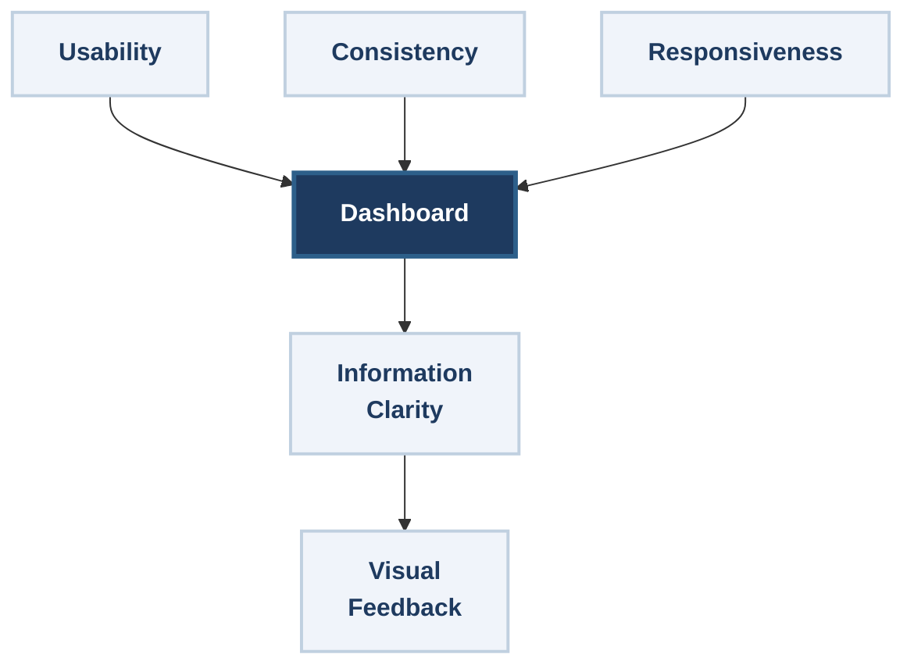

```mermaid
%% Figure 3.7 — Dashboard Design Principles
%% Conceptual diagram showing the five principles that guided the dashboard UI development

graph TB
    classDef center fill:#1E3A5F,color:#fff,stroke:#2D5F8A,stroke-width:3px,font-weight:700,font-size:16px
    classDef principle fill:#F0F4FA,color:#1E3A5F,stroke:#C0D0E0,stroke-width:2px,font-weight:700

    DASH["Dashboard"]:::center
    P1["Usability"]:::principle
    P2["Consistency"]:::principle
    P3["Responsiveness"]:::principle
    P4["Information<br/>Clarity"]:::principle
    P5["Visual<br/>Feedback"]:::principle

    P1 --> DASH
    P2 --> DASH
    P3 --> DASH
    DASH --> P4
    P4 --> P5
```
