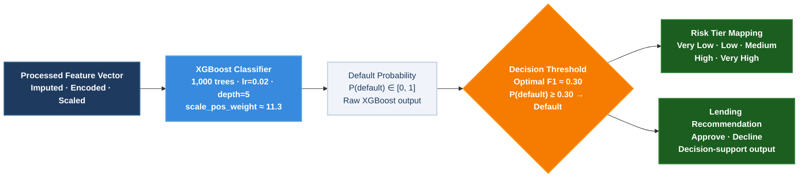

```mermaid
%% Figure 4.X — Model Inference and Risk Tiering Process
%% Inference stage: feature vector → XGBoost → probability → threshold evaluation → risk tier + lending recommendation

graph LR
    classDef input fill:#1E3A5F,color:#fff,stroke:#2D5F8A,stroke-width:2px,font-weight:700
    classDef process fill:#F0F4FA,color:#1E3A5F,stroke:#C0D0E0,stroke-width:2px
    classDef model fill:#378ADD,color:#fff,stroke:#5A9DE0,stroke-width:2px,font-weight:700
    classDef decision fill:#F57C00,color:#fff,stroke:#FB8C00,stroke-width:2px,font-weight:700
    classDef output fill:#1B5E20,color:#fff,stroke:#2E7D32,stroke-width:2px,font-weight:700

    FV["Processed Feature Vector<br/>Imputed · Encoded · Scaled"]:::input
    XGB["XGBoost Classifier<br/>1,000 trees · lr=0.02 · depth=5<br/>scale_pos_weight ≈ 11.3"]:::model
    PROB["Default Probability<br/>P(default) ∈ [0, 1]<br/>Raw XGBoost output"]:::process
    THRESH{"Decision Threshold<br/>Optimal F1 ≈ 0.30<br/>P(default) ≥ 0.30 → Default"}:::decision
    TIER["Risk Tier Mapping<br/>Very Low · Low · Medium<br/>High · Very High"]:::output
    DECISION["Lending Recommendation<br/>Approve · Decline<br/>Decision-support output"]:::output

    FV --> XGB
    XGB --> PROB
    PROB --> THRESH
    THRESH --> TIER
    THRESH --> DECISION
```
