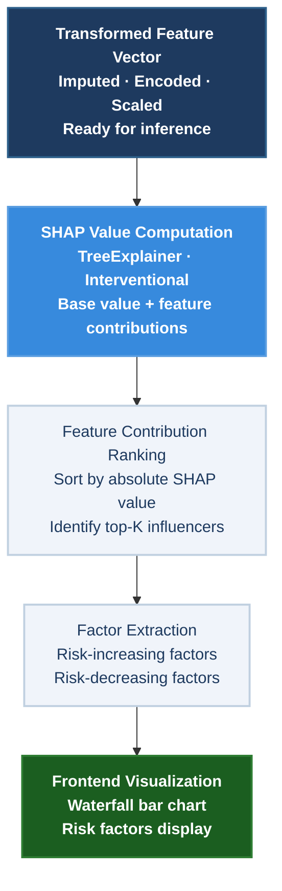

```mermaid
%% Figure 4.X — SHAP Explainability Workflow
%% Explainability process: feature vector → SHAP computation → contribution ranking → factor extraction → frontend visualization

graph TB
    classDef input fill:#1E3A5F,color:#fff,stroke:#2D5F8A,stroke-width:2px,font-weight:700
    classDef process fill:#F0F4FA,color:#1E3A5F,stroke:#C0D0E0,stroke-width:2px
    classDef model fill:#378ADD,color:#fff,stroke:#5A9DE0,stroke-width:2px,font-weight:700
    classDef output fill:#1B5E20,color:#fff,stroke:#2E7D32,stroke-width:2px,font-weight:700

    FV["Transformed Feature Vector<br/>Imputed · Encoded · Scaled<br/>Ready for inference"]:::input
    SHAP["SHAP Value Computation<br/>TreeExplainer · Interventional<br/>Base value + feature contributions"]:::model
    RANK["Feature Contribution Ranking<br/>Sort by absolute SHAP value<br/>Identify top-K influencers"]:::process
    EXTRACT["Factor Extraction<br/>Risk-increasing factors<br/>Risk-decreasing factors"]:::process
    VIZ["Frontend Visualization<br/>Waterfall bar chart<br/>Risk factors display"]:::output

    FV --> SHAP
    SHAP --> RANK
    RANK --> EXTRACT
    EXTRACT --> VIZ
```
