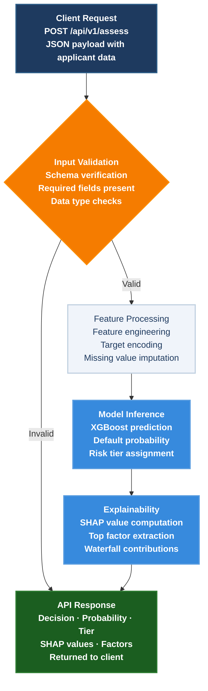

```mermaid
%% Figure 4.X — RESTful API Processing Workflow
%% API sequence: request → validation → feature processing → inference → explainability → response

graph TB
    classDef input fill:#1E3A5F,color:#fff,stroke:#2D5F8A,stroke-width:2px,font-weight:700
    classDef process fill:#F0F4FA,color:#1E3A5F,stroke:#C0D0E0,stroke-width:2px
    classDef model fill:#378ADD,color:#fff,stroke:#5A9DE0,stroke-width:2px,font-weight:700
    classDef output fill:#1B5E20,color:#fff,stroke:#2E7D32,stroke-width:2px,font-weight:700
    classDef decision fill:#F57C00,color:#fff,stroke:#FB8C00,stroke-width:2px,font-weight:700

    REQ["Client Request<br/>POST /api/v1/assess<br/>JSON payload with applicant data"]:::input
    VAL{"Input Validation<br/>Schema verification<br/>Required fields present<br/>Data type checks"}:::decision
    FEAT["Feature Processing<br/>Feature engineering<br/>Target encoding<br/>Missing value imputation"]:::process
    INFER["Model Inference<br/>XGBoost prediction<br/>Default probability<br/>Risk tier assignment"]:::model
    EXPLAIN["Explainability<br/>SHAP value computation<br/>Top factor extraction<br/>Waterfall contributions"]:::model
    RESP["API Response<br/>Decision · Probability · Tier<br/>SHAP values · Factors<br/>Returned to client"]:::output

    REQ --> VAL
    VAL -->|Valid| FEAT
    VAL -->|Invalid| RESP
    FEAT --> INFER
    INFER --> EXPLAIN
    EXPLAIN --> RESP
```
