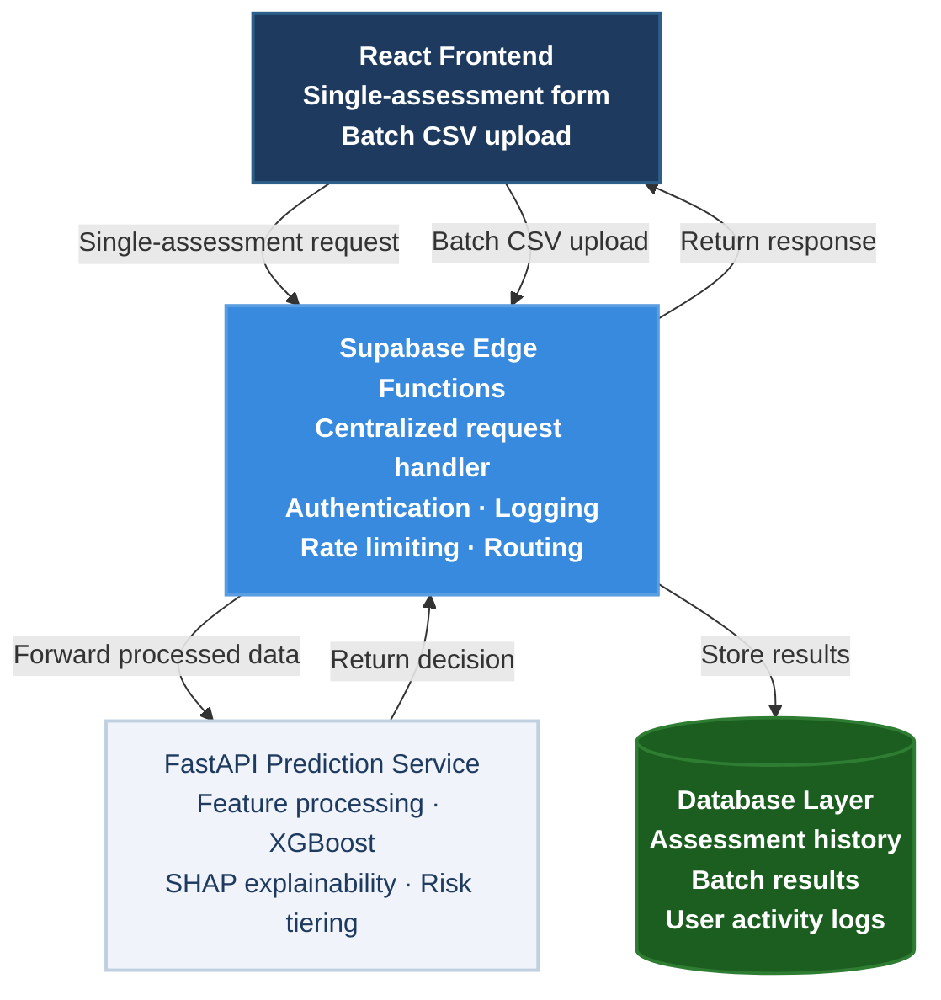

```mermaid
%% Figure 4.X — Edge Function Integration Workflow
%% Request flow: frontend → Supabase Edge Functions → FastAPI + database

graph TB
    classDef frontend fill:#1E3A5F,color:#fff,stroke:#2D5F8A,stroke-width:2px,font-weight:700
    classDef edge fill:#378ADD,color:#fff,stroke:#5A9DE0,stroke-width:2px,font-weight:700
    classDef backend fill:#F0F4FA,color:#1E3A5F,stroke:#C0D0E0,stroke-width:2px
    classDef db fill:#1B5E20,color:#fff,stroke:#2E7D32,stroke-width:2px,font-weight:700

    UI["React Frontend<br/>Single-assessment form<br/>Batch CSV upload"]:::frontend
    EDGE["Supabase Edge Functions<br/>Centralized request handler<br/>Authentication · Logging<br/>Rate limiting · Routing"]:::edge
    API["FastAPI Prediction Service<br/>Feature processing · XGBoost<br/>SHAP explainability · Risk tiering"]:::backend
    DB[("Database Layer<br/>Assessment history<br/>Batch results<br/>User activity logs")]:::db

    UI -->|Single-assessment request| EDGE
    UI -->|Batch CSV upload| EDGE
    EDGE -->|Forward processed data| API
    EDGE -->|Store results| DB
    API -->|Return decision| EDGE
    EDGE -->|Return response| UI
```
