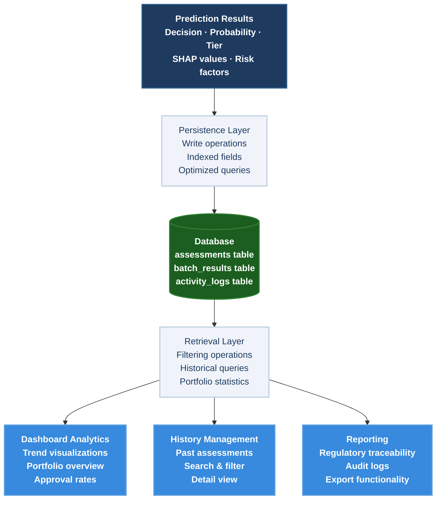

```mermaid
%% Figure 4.6 — Database Persistence Workflow
%% Storage flow: prediction results → database → dashboard analytics, history, reporting

graph TB
    classDef input fill:#1E3A5F,color:#fff,stroke:#2D5F8A,stroke-width:2px,font-weight:700
    classDef process fill:#F0F4FA,color:#1E3A5F,stroke:#C0D0E0,stroke-width:2px
    classDef db fill:#1B5E20,color:#fff,stroke:#2E7D32,stroke-width:2px,font-weight:700
    classDef output fill:#378ADD,color:#fff,stroke:#5A9DE0,stroke-width:2px,font-weight:700

    PRED["Prediction Results<br/>Decision · Probability · Tier<br/>SHAP values · Risk factors"]:::input
    STORE["Persistence Layer<br/>Write operations<br/>Indexed fields<br/>Optimized queries"]:::process
    DB[("Database<br/>assessments table<br/>batch_results table<br/>activity_logs table")]:::db
    RETRIEVE["Retrieval Layer<br/>Filtering operations<br/>Historical queries<br/>Portfolio statistics"]:::process
    DASH["Dashboard Analytics<br/>Trend visualizations<br/>Portfolio overview<br/>Approval rates"]:::output
    HIST["History Management<br/>Past assessments<br/>Search & filter<br/>Detail view"]:::output
    REPORT["Reporting<br/>Regulatory traceability<br/>Audit logs<br/>Export functionality"]:::output

    PRED --> STORE
    STORE --> DB
    DB --> RETRIEVE
    RETRIEVE --> DASH
    RETRIEVE --> HIST
    RETRIEVE --> REPORT
```
