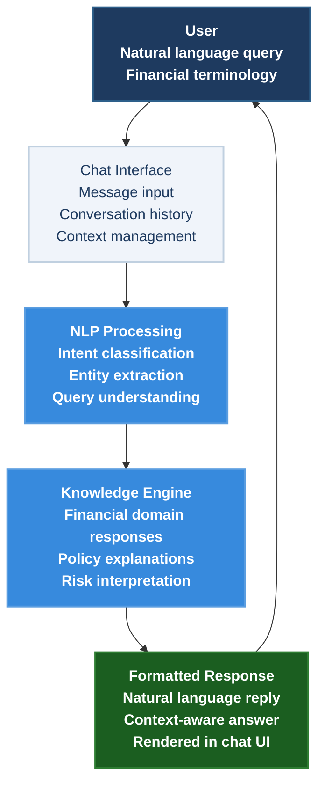

```mermaid
%% Figure 4.X — Conversational AI Interface
%% Chatbot flow: user query → NLP → knowledge response → rendered reply

graph TB
    classDef frontend fill:#1E3A5F,color:#fff,stroke:#2D5F8A,stroke-width:2px,font-weight:700
    classDef process fill:#F0F4FA,color:#1E3A5F,stroke:#C0D0E0,stroke-width:2px
    classDef model fill:#378ADD,color:#fff,stroke:#5A9DE0,stroke-width:2px,font-weight:700
    classDef output fill:#1B5E20,color:#fff,stroke:#2E7D32,stroke-width:2px,font-weight:700

    USER["User<br/>Natural language query<br/>Financial terminology"]:::frontend
    CHAT["Chat Interface<br/>Message input<br/>Conversation history<br/>Context management"]:::process
    NLP["NLP Processing<br/>Intent classification<br/>Entity extraction<br/>Query understanding"]:::model
    KNOWLEDGE["Knowledge Engine<br/>Financial domain responses<br/>Policy explanations<br/>Risk interpretation"]:::model
    REPLY["Formatted Response<br/>Natural language reply<br/>Context-aware answer<br/>Rendered in chat UI"]:::output

    USER --> CHAT
    CHAT --> NLP
    NLP --> KNOWLEDGE
    KNOWLEDGE --> REPLY
    REPLY --> USER
```
