# Figure 3.1 — High-Level Development Lifecycle Diagram
## Phase flow from data acquisition to deployment

```mermaid
%% Figure 3.1: High-Level Development Lifecycle Diagram
%% Shows the complete project lifecycle: Data → Preprocessing → EDA → Modeling → Evaluation → System Design → Deployment
%% Each phase includes key activities, technologies used, and output artifacts

graph TB
    %% ── Styles ──────────────────────────────────────────────────────────────
    classDef phase fill:#1E3A5F,color:#fff,stroke:#2D5F8A,stroke-width:2px,font-weight:700
    classDef activity fill:#F0F4FA,color:#1E3A5F,stroke:#C0D0E0,stroke-width:1px
    classDef output fill:#E8F0E8,color:#2D6A2D,stroke:#A0C0A0,stroke-width:1px,dash
    classDef tech fill:#FFF8DC,color:#8B6914,stroke:#D4C080,stroke-width:1px
    classDef final fill:#1B5E20,color:#fff,stroke:#2E7D32,stroke-width:2px,font-weight:700

    %% ── Phase 1: Data Acquisition ───────────────────────────────────────────
    subgraph PHASE1["Phase 1: Data Acquisition"]
        direction TB
        A1[Data Source<br/>Home Credit Default Risk<br/>Kaggle Competition]:::phase
        A2[Load Datasets<br/>application_train.csv<br/>application_test.csv<br/>bureau.csv]:::activity
        A3[<b>Output:</b> Raw DataFrames<br/>307,511 train + 48,744 test<br/>+ 1.7M bureau records]:::output
        A4[Tech: pandas, numpy]:::tech
    end

    %% ── Phase 2: Data Preprocessing & Feature Engineering ──────────────────
    subgraph PHASE2["Phase 2: Data Preprocessing & Feature Engineering"]
        direction TB
        B1[Missing Value Handling<br/>Drop >70% null columns<br/>Median imputation]:::activity
        B2[Anomaly Correction<br/>DAYS_EMPLOYED sentinel fix<br/>CODE_GENDER XNA fix]:::activity
        B3[Categorical Encoding<br/>Target Encoding 5 vars<br/>k=20, 5-fold stratified<br/>Label Encoding remainder]:::activity
        B4[Feature Engineering<br/>87+ features across 6 groups:<br/>Age · Financial · EXT_SOURCE<br/>Occupation · Bureau · Docs]:::activity
        B5[<b>Output:</b> Clean Feature Matrix<br/>87 columns, no missing values<br/>Train/Test aligned]:::output
        B6[Tech: pandas, scikit-learn<br/>SimpleImputer, LabelEncoder]:::tech
    end

    %% ── Phase 3: Exploratory Data Analysis ─────────────────────────────────
    subgraph PHASE3["Phase 3: Exploratory Data Analysis"]
        direction TB
        C1[Target Distribution<br/>~8.3% default rate<br/>Imbalance ratio ≈ 11:1]:::activity
        C2[Correlation Analysis<br/>EXT_SOURCE_2 & 3 strongest<br/>negative correlates of default]:::activity
        C3[Categorical Breakdowns<br/>Age groups · Education<br/>Occupation tiers · Contract types]:::activity
        C4[<b>Output:</b> Statistical Insights<br/>Feature ranking · PD rates<br/>Visualization dashboard]:::output
        C5[Tech: matplotlib, seaborn]:::tech
    end

    %% ── Phase 4: Model Development ─────────────────────────────────────────
    subgraph PHASE4["Phase 4: Machine Learning Model Development"]
        direction TB
        D1[Logistic Regression<br/>C=0.1, L2, balanced<br/>SMOTE + scaled]:::activity
        D2[Decision Tree<br/>max_depth=8, leaf=50<br/>SMOTE + unscaled]:::activity
        D3[Random Forest<br/>200 trees, depth=12<br/>SMOTE + unscaled]:::activity
        D4[XGBoost<br/>1000 trees, lr=0.02<br/>scale_pos_weight=11.3]:::activity
        D5[Neural Network<br/>512→256→128→64<br/>BatchNorm + Dropout]:::activity
        D6[<b>Output:</b> 5 Trained Models<br/>+ Serialized artifacts<br/>xgb_model.pkl, scaler.pkl<br/>imputer.pkl, te_maps.pkl]:::output
        D7[Tech: scikit-learn, XGBoost<br/>TensorFlow/Keras, joblib]:::tech
    end

    %% ── Phase 5: Model Evaluation ──────────────────────────────────────────
    subgraph PHASE5["Phase 5: Model Evaluation & Selection"]
        direction TB
        E1[5-Fold Stratified<br/>Cross-Validation<br/>Mean AUC ± std]:::activity
        E2[Optimal Threshold<br/>PR curve → max F1<br/>Not default 0.5]:::activity
        E3[Metrics Comparison<br/>AUC-ROC · Avg-Prec · F1<br/>Precision · Recall · Accuracy]:::activity
        E4[Explainability<br/>SHAP TreeExplainer<br/>Beeswarm · Waterfall · Bar]:::activity
        E5[<b>Output:</b> XGBoost Selected<br/>Best AUC + Avg-Prec<br/>5 risk tiers defined<br/>SHAP feature ranking]:::output
        E6[Tech: sklearn.metrics<br/>shap, matplotlib]:::tech
    end

    %% ── Phase 6: System Architecture & Design ──────────────────────────────
    subgraph PHASE6["Phase 6: System Architecture & Design"]
        direction TB
        F1[Backend ML API<br/>FastAPI + Pydantic<br/>3 endpoints: health,<br/>predict, predict/batch]:::activity
        F2[Edge Function Proxy<br/>Supabase Deno/TS<br/>credit-risk-single<br/>credit-risk-batch]:::activity
        F3[Frontend Dashboard<br/>React 18 + TypeScript<br/>Vite + Tailwind + Recharts<br/>13 pages, 49 UI components]:::activity
        F4[Database Schema<br/>Supabase PostgreSQL<br/>RLS by user_id<br/>loan_applications + profiles]:::activity
        F5[Security Layer<br/>JWT Auth · Input validation<br/>TLS/SSL · Audit trail<br/>GDPR consent capture]:::activity
        F6[<b>Output:</b> Fully Integrated System<br/>Presentation ↔ App ↔ Data tiers<br/>Graceful degradation]:::output
        F7[Tech: FastAPI, Docker<br/>React, Supabase, Mistral AI]:::tech
    end

    %% ── Phase 7: Deployment ─────────────────────────────────────────────────
    subgraph PHASE7["Phase 7: Deployment"]
        direction TB
        G1[Containerization<br/>Docker multi-stage build<br/>python:3.11-slim image]:::activity
        G2[Cloud Hosting<br/>Python API → Railway/Render<br/>Frontend → Vercel/Netlify<br/>Supabase Cloud]:::activity
        G3[Monitoring<br/>Health endpoint check<br/>Environment config via<br/>secrets management]:::activity
        G4[<b>Final Output:</b> Production System<br/>Live URL · API docs<br/>UML documentation<br/>User manual]:::final
        G5[Tech: Docker, Railway<br/>Vercel, Supabase]:::tech
    end

    %% ── Flow Connections ────────────────────────────────────────────────────
    A1 --> A2 --> A3 --> A4
    A4 --> B1
    B1 --> B2 --> B3 --> B4 --> B5 --> B6
    B6 --> C1
    C1 --> C2 --> C3 --> C4 --> C5
    C5 --> D1
    C5 --> D2
    C5 --> D3
    C5 --> D4
    C5 --> D5
    D1 --> D6
    D2 --> D6
    D3 --> D6
    D4 --> D6
    D5 --> D6
    D6 --> D7
    D7 --> E1
    E1 --> E2 --> E3 --> E4 --> E5 --> E6
    E6 --> F1
    E6 --> F2
    E6 --> F3
    E6 --> F4
    E6 --> F5
    F1 --> F6
    F2 --> F6
    F3 --> F6
    F4 --> F6
    F5 --> F6
    F6 --> F7
    F7 --> G1
    G1 --> G2 --> G3 --> G4 --> G5

    %% ── Phase labels on the side ────────────────────────────────────────────
    PHASE1 -.->|CRISP-DM<br/>Phase 1-2| PHASE2
    PHASE2 -.->|CRISP-DM<br/>Phase 3| PHASE3
    PHASE3 -.->|CRISP-DM<br/>Phase 4| PHASE4
    PHASE4 -.->|CRISP-DM<br/>Phase 5| PHASE5
    PHASE5 -.->|CRISP-DM<br/>Phase 6| PHASE6
    PHASE6 -.->|DevOps| PHASE7
```

## Figure Caption

**Figure 3.1 — High-Level Development Lifecycle Diagram.** The complete project lifecycle spans seven phases, from raw data acquisition through preprocessing, exploratory analysis, model development, evaluation, system architecture design, and production deployment. Each phase lists key activities, output artifacts (green dashed boxes), and the core technologies used (gold boxes). The phases align with the CRISP-DM methodology (Phases 1–2: Business & Data Understanding; Phase 3: Data Preparation; Phase 4: Modeling; Phase 5: Evaluation; Phase 6: Deployment), with the final DevOps phase covering containerization and cloud hosting.
